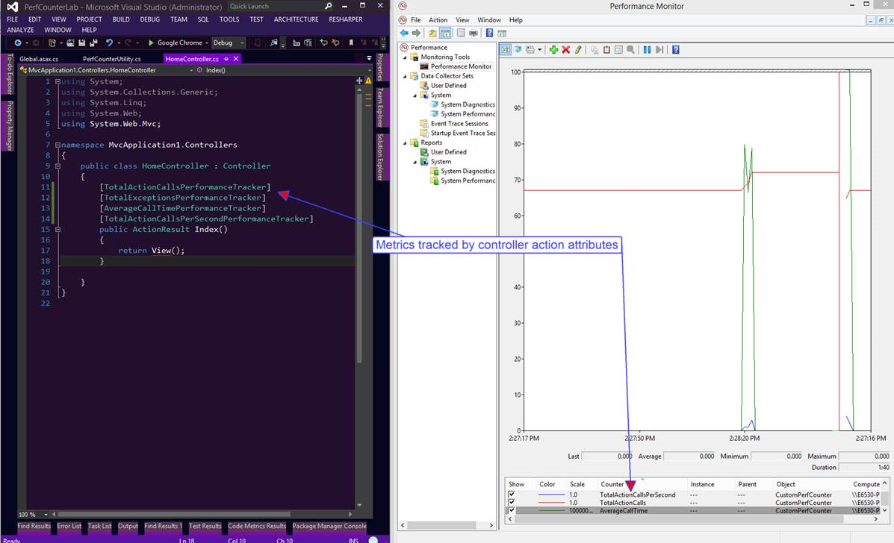

MvcPerfmon
==========

Unobtrusively integrate perf counters into ASP.NET MVC by using action filter attributes.

## Installation/Config
Step 0. - Describe the things you intend to track in terms of perfmon counters. [Be sure to understand the different types of performance counters available](http://msdn.microsoft.com/query/dev11.query?appId=Dev11IDEF1&l=EN-US&k=k(System.Diagnostics.PerformanceCounterType.AverageBase);k(TargetFrameworkMoniker-.NETFramework,Version%3Dv4.5);k(DevLang-csharp)&rd=true). Check out the sample web app to see how a basic perf counter is built.
  
Step 1. - Reference MvcPerfmon library in the target web app

Step 2. - Register IPerfCounterUtility as a singleton in your service locator. Note there is a mock implementation that allows you to disable monitoring.

Step 3. - Ensure your service locator provides dependency injection for ActionFilterAttributes. In the sample web app Autofac is used.

Step 4. - In the Global.asax.cs bootstrap the perf counter utility by passing it a list of performance metrics to be tracked. If they exist, they will be preserved. If they do not exist, they will be created at application startup.

Step 5.- Implement custom filter. Extend the MvcPerformanceTrackerAttribute and add your custom code for what you want to track.

Step 6. - Decorate controllers/actions with your custom filter.

This design registers custom perf counters on application startup and it may require elevated privileges.

